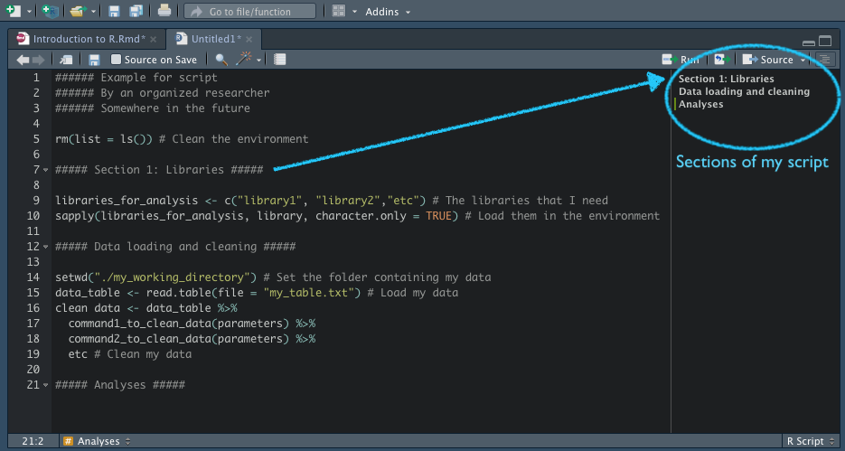

```{r setup, include=FALSE}
knitr::opts_chunk$set(echo = TRUE)
```

```{r echo=FALSE, results='hide', include=FALSE}
packages <- c("car","lme4","ggplot2", "dplyr", "tidyr" ,"scales" ,"broom" ,"gridExtra",  "Hmisc", "see", "ggfortify", "knitr")
sapply(packages, library, character.only = TRUE)
```

# Introduction to R programming

R is an open source software based on the language of S-plus, its paid equivalent. Nowadays R is one of the main statistical softwares used across all disciplines. Like any software, it has it own advantages and disadvantages.

Adavantages:

* Freeware.
* Most new statistical methods are first implemented in R.
* Open source.
* Documentation is available in the internet.
* Plenty of forums with people willing to provide help.

Disadvantages:

* Command line (is this really a disadvantage?).
* It does not have a GUI (but R studio solved this).
* Learning curve can be slow.
* Is there any real disadvantage?

## Getting started

First of all, you need to download and install R and R studio in your computer. Both softwares are available for Windows, iOS, and Linux. They can be found at:

* R: https://cran.r-project.org/
* r Studio: https://www.rstudio.com/

**Note:** It is important to keep in mind that R has to be installed before installing r Studio.

## How should my rStudio GUI should look like?

No matter what computer and OS you are using, your rStudio device should always contain four windows in it: Script, Console, Environment, and viewer (for plots, help, packages).


## Scripts are the best way to organize your workflow

Always work on a script. It does not only looks more organized but:

* You can always go back to old analyses, and run them without having to re-write the whole code.
* Easy to review, and thus prevent any mistakes in your analysis.
* Easy to share, which is a key point of open science.
* You can reuse them for other projects.

A clean script always contains:

* A header containing the title of the project, author(s), and date
  
  ```{r}
  ###### Data Analysis
  ###### A coccidian infection affects migratory restlessness of a passerine bird during stopover
  ###### D. Hebinger, Y. Vortman, J.L. Perret, J.C. Koella, and A. Rojas Mora
  ###### Oikos 2021
  ```
  
* A command to clean your environment.

  ```{r eval=FALSE}
  rm(list = ls())
  ```

* A section to load the libraries that you will use in your analyses.
  
  ```{r eval=FALSE}
  libraries_for_analysis <- c("library1", "library2","etc")
  sapply(libraries_for_analysis, library, character.only = TRUE)
  ```
* A section to load and clean data.

  ```{r eval=FALSE}
  setwd("./my_working_directory")
  data_table <- read.table(file = "my_table.txt")
  clean data <- data_table %>% # this is a pipeline
                  commands_to_clean_data(parameters)
  ```

* Finally, your analyses.

**NOTE:** Always remember to put a lot of comments on your script, as it is the most efficient way to keep track of what you did. Comments also will help other peers to understand your script. Comments are not executed by R, so feel free to use them.

  ```{r}
  # Every comment in R starts with the symbol '#' and all the text following it will not be executed by R for that line of code.
  # This is a comment. To make our life easier and our work more professional, r Studio has a really nice feature where any text between 5 consequtive hashtags will create a section for your script.
  ##### This is my new section #####
  ```
  

  
## Libraries

The environment in R does not have all the tools that you might need loaded, however there are various base packages that are loaded every time you start a new session. Libraries contain commands that are specific to certain functionalities (e.g. data management, statistical analysis, visualization tools, etc.), and they can be easily downloaded and install from repositories (e.g. CRAN). Fortunately, this is automatically done by R if you have an internet connection.

### Installing libraries

You can type and execute the following command:

```{r eval=FALSE}
install.packages('library_name')
```

Alternatively, you can go to Tools -> Install packages, and there you can look for the library that you would like to install.

**NOTE: It is recommended to install the dependencies of the library that you are willing to install.**

### Loading libraries

You can load your libraries in the environment using the following command:

```{r eval=FALSE}
library(library_name)
```

ALternatively, you can go to the "Packages" tab on the visual panel of r Studio and click on the libraries that you would like to load. However, I strongly recommend to type the command above and keep it on your script, like that your script will always load the necesary libraries for your task.

#### Exercise

Try to install the following libraries:

* tidyr
* dplyr
* broom
* ggplot2
* gridExtra
* ggfortify
* car

## Getting started with command line

Let us get started by using R as a calculator.

```{r echo=TRUE}
# You can do simple operations exactly as done in a calculator:
1 + 1
# And you can do it line by line or having several in a line separated by a semicolon
2 * 3 ; 2^3 ; 10 / 4
# R uses standard precedence rules
(10 + 2*8) / 10
# R also contains common mathematical expresions such as:
log(1) ; sin(pi)
```

## Getting help in R

Each command has a help page with examples, and this is the main tool used to learn R. Within R, you can use commands to get help such as:

```{r eval=FALSE}
# Alternative 1
?log
# Alternative 2
help(log)
```

{width=80%}

Additionally, you can use queries that are less specific or just load the whole help page.

```{r eval=FALSE}
# Start the documentation of R
help.start()
# Display commands related to a general query
help.search('my_query_word')
```

Finally, **the most important tool to obtain help in R is Google**. There you will easily find the documentation for R and various libraries. Also, there are various forums where people asks and solve questions about R, so do not hesistate to check those.

## Adding objects to the environment

To this point, you should be able to do simple operations with R and execute simple commands, however we did not store any of the results yet. In R, everything is stored in objects, and the notation is quite simple:

```{r echo=TRUE}
# Create your object to store your result
result <- 1 + 1
# Call your result
result
```

R is very flexible on what can be stored in an object, and objects can thus contain data tables, figures, statistical tests, or even all of that (this is a type of object called list).

Within this frame, the most powerful feature of R is vectorial operations. An object containing a set of numbers can be refer as a vector, however this operations work in a simpler way than linear algebra. Instead, operations between vectors are executed by matching the index of each element within the vector. This means that the first element of vector 1 will be matched with the first element of vector 2, and so on. For example, the sum of two vectors in R would work as:


We can confirm the above in R by creating two vectors from 1 to 5 and doing the sum of them:

```{r echo=TRUE}
vector_1 <- c(1:5) # concatenate 1 to 5, try typing ?c
vector_2 <- seq(from = 1, to = 5, by = 1) # make the sequence from 1 to 5 with steps of 1
vector_1 + vector_2
```

## Indexing an object

As mentioned above, objects can contain 1 or various elements within them. Thus, at times you might just be interested in one single element of an object, and to extract it we would use indexing. Lets say you are interested in the third object of the sum between vector 1 and vector 2.

```{r}
vector_1 <- c(1:5) # concatenate 1 to 5, try typing ?c
vector_2 <- seq(from = 1, to = 5, by = 1) # make the sequence from 1 to 5 with steps of 1
result <- vector_1 + vector_2 # now we store our result in an object
result[3] # we use the square brackets to index our object
```

Above we managed to obtain the third element of our object, which is 6. One important feature of indexing, is that we can use conditional statements to index objects. For example, imagine you are only interested in values that are larger than 5.

```{r}
vector_1 <- c(1:5) # concatenate 1 to 5, try typing ?c
vector_2 <- seq(from = 1, to = 5, by = 1) # make the sequence from 1 to 5 with steps of 1
result <- vector_1 + vector_2 # now we store our result in an object
result[result > 5] # now we use a conditional statement to index the object
```

It is important to keep in mind that only elements where our condition is true will be kept during the indexing. This is a very important tool to tidy data, as your objects will rarely be ordered as the current example. So lets take a look at what the conditional statement returns:

```{r}
result > 5
```

Does this correspond to what we indexed above?

## Conditional statements

Above we used a conditional statement, which is characterized by having either TRUE or FALSE as elements. In R they are also called logical expressions, as we will later see in the classes of objects that are stored in the R environment. An useful feature of logical objects, is that TRUE is coded as 1 while FALSE is coded as 0. Bellow you can find some of the most common logical operators in R:


|     In R     |                    For us                   | Example |
|:------------:|:--------------------------------------------|:-------------------------|
|      ==      | Equal to                                    | result == 4              |
|      !=      | Does not equal to                           | result != 4              |
| <, >, <=, >= | Less than, greater than, less or equal, greater or equal | result <= 4 |
|       &      | And                                         | result > 2 & result < 6  |
|       \|     | Or                                          | result > 2 \| result < 6 |


### Exercise

Try to put in console the examples on the table above. What are your results?


## Matrices

Let us now extend our objects to two dimensions: rows and columns. While it might seem more complicated at first, all the above concepts will work for matrices - and later on tables, which are known as data.frames in R-.

```{r}
my_matrix <- matrix(data = 1:12, # sequence of numbers from 1 to 12
                    nrow = 4, # 4 rows
                    ncol = 3, # 3 columns
                    byrow = FALSE) # Fill the matrix by columns
my_matrix
```

We can similarly index matrices and data frames using square brackets, but we will now need two dimensions within them.

```{r}
# Slice the second column of my_matrix
my_matrix[,2]

# Slice the first row of my_matrix
my_matrix[1,]

# Take the element in the third row and the first column
my_matrix[3,1]
```

**WARNING** When you would like to work on your data table (or data frame, using the correct jaRgon), you can and will use the same sintax. If you have any doubts, please do not hesitate to ask any question.

## Data types in R

There are various data types in R, but we will mainly focus on the following:

| Data Type | Description | Example |
|:--|:--|:--|
|  *logical*  | TRUE and FALSE | TRUE |
| *character* | Character string | "This is a character string |
| *numeric* | Integers and real numbers | 1, 5.1 |
| *factor* | A special case of character, where one has levels | treatment1, treatment2 |

## Exercise sheet 1

Please open the exercise sheet 1 and try to solve the exercises. Remember that this will not be graded, though I highly recommend that you invest time in it, as this is the only way that you will really learn during this course. And remember, you will need a lot of error to learn:


### Solutions for exercise sheet one

**Exercise 1** Use R to calculate the following:

$4^6$, $9!$, $\sqrt{\pi}$

```{r}
4^6 ; factorial(9) ; sqrt(pi)
```

**Exercise 2** In R vectors are used everywhere.So, try to do the following

* create an object v1 as the vector $(1,2,3,…,49,50)$

  ```{r}
  v1 <- c(1:50)
  v1
  ```

* Create an object v2 as the vector $(3,5,7,11,17)$
  
  ```{r}
  v2 <- c(3,5,7,11,17)
  v2
  ```

* Create an object v3 as the vector $(3,5,7,11,13,17,0,1,2,3,…,48,49,50)$
  
  ```{r}
  v3 <- c(v2, 0, v1)
  v3
  ```

* Create an object v4 as the vector $(0.0,0.1,0.2,…,4.8,4.9)$
  
  ```{r}
  v4 <- (v1 - 1) / 10
  v4
  ```

* Create an object v5 as the vector $(2,4,6,8,10,12,…,96,98,100)$
  
  ```{r}
  v5 <- v1 * 2
  v5
  ```

* Create an object smoker as the vector of length 100

  (“yes”,“no”,“no”, “yes”,“no”,“no”,…,“yes”,“no”,“no”, “yes”)

  ```{r}
  smoker <- rep(c("yes", "no", "no"), length.out = 100)
  smoker
  ```

* Create an object treatment as the vector of length 100

  (“treated”,“control”,“treated”,“control”,…,“treated”,“control”,“treated”,“control”)

  ```{r}
  treatment <- rep(c("treated", "control"), 50)
  treatment
  ```

* Sum over all the elements of v1.
  
  ```{r}
  sum(v1)
  ```

*	What is the product of all the elements of v2

    ```{r}
    prod(v2)
    ```

**Exercise 3** Create the following object containing the age of 100 persons

```{r}
age <- round( rexp(100, 0.05) + 10 , 0)
age
```

* A group of researchers collect data on smoking habits from 100 persons. Using the vector smoker, find how many smokers are under 18.

  ```{r}
  sum(smoker == "yes" & age < 18)
  ```

* Create a new vector x using all the even elements of age that are larger or equal than 18. What is the minimum value of all the elements contained in x.

  ```{r}
  x <- age[age%%2 == 0 & age >= 18] ; x ; min(x)
  ```

* The researchers treated half of the individuals with a drug that reduces the addictive effects of nicotine. Create a vector x1 with the age of treated smokers.

  ```{r}
  x1 <- age[treatment == "treated" & smoker == "yes"]
  x1
  ```

*	Produce a vector x2 containing the age of non-smokers or treated individuals.

    ```{r}
    x2 <- age[treatment == "treated" | smoker == "no"]
    x2
    ```
  
**Exercise 4** Using the commands sum() or prod() calculate

$\sum_{i=1}^{20} \frac{1}{i}$, $\prod_{i=1}^{20} (2i^2 - i)$

```{r}
i <- c(1:20)
sum(1/i)
prod(2*i^2 - i)
```

# Data management / wrangling


One of the most important uses of R is to prepare your data to be either visualized or analyzed. Ideally you would do so using an R script, given that:

* Your R script can be reviewed by other peers, and thus your data management will be less likely to contain mistakes.

* Reproducible.

* Data management in R does not modify your raw data, and thus if something goes wrong your data is still safe.

* You can manage large amounts of data with just a few lines of code.

But before we get our hands on data, we need to learn how to load data into the R environment.

## Loading data in R

It is possible to load different types of data into R, such as images, rasters, DNA sequences, simple excel data sheets, and more. Thus, R can support a large range of files. In this course we will focus on data frames, and the best options for such type of data are **.txt** and/or **.csv** files.

### How does my data file looks like?

Bellow I will provide an example of how a .csv with tabulation separated values would look like.

"Gender";"Age";"Grade"  {width=10%}  Headers: this corresponds to your column names, and they should be the first line in the file.
"Control";"Female";2.5
"Control";"Female";2.7
"Control";"Female";2.4
"Control";"Male";NA
"Control";"Male";2.5
"Control";"Male";2.9   {width=10%} All this following lines are your data. Each line is a row in your table.

### How to load your data frame?

Now that we know how our data frame base files should look like, we should bring them into the R environment. This consist of two easy steps, first you need to define the directory where you will be working ( [Scripts are the best way to organize your workflow](How a clean script looks like) ), and then you can use the command ```write.table()``` to load your data. Note that this is a generic command, where you can modify the separator of your data (e.g. tabulation, semicolon, colon, etc) and the decimals (e.g. comma, dot), among various other things. Read the documentation of this base command by typing ```?write.table``` in your console, there you will find a complete set of arguments.

There is also data that is build in libraries, and that can be load with the command ```data()```. For example, we can load a very famous dataset on floral morphology of three species of *Iris*. If you are curious about those data, check out the [Wikipedia](https://en.wikipedia.org/wiki/Iris_flower_data_set) site that explains these data in detail.

```{r}
data(iris)
head(iris)
```

#### Troubleshooting

You can face a number of problems when loading your data frames into R, however the most common ones are:

* A line has more or less elements than what is expected with the headers.

  ```{r error=TRUE}
  mydata <- read.table(file = "./Data/example_table_incomplete.csv",
                       h = TRUE,
                       sep = ";")
  ```

  

* You might have missing data in a given row, and that should be filled with an NA instead of leaving an empty space.

  ```{r error=TRUE}
  mydata <- read.table(file = "./Data/example_table.csv",
                       h = TRUE,
                       sep = ";")
  str(mydata) # this command is very useful and one that should be routinarily used, as it shows the structure of your dataset, including variables, type of data for each variable, and number of observations.
  head(mydata) # This command lets you see the first 10 rows of your table.
  ```

* At times when you create a *.csv* or a *.txt* with excel, it adds some invisible characters or an empty line at the end of the file.

### How to save your data set

After you have work on your data and it is tidy enough to be analyzed, you might want to save your clean dataset. This is also easily done in R using the command ```write.table()```. If we would like to save our table above:

```{r}
write.table(mydata, # You start with the object containing the dataset that you would like to save.
            file = "mynewdata.txt", # Then you give a name to your file, remember to add the extension.
            row.names = FALSE, # In the background, the R environment assigns names to rows, usually 1 to N number of data in it, and you do not want that in your exported table.
            sep = ";") # Lastly, we can assign what separator we want to have for our columns.

# Let's now verify if it properly worked:
newtable <- read.table(file = "mynewdata.txt",
                       h = TRUE,
                       sep = ";")
head(newtable)
```

## Data wrangling

> "Happy families are all alike. Every unhappy family is unhappy in its own way" *Leo Tolstoy*

> "Like families, tidy datasets are all alike. Every messy dataset is messy in its own way" *Hadley Wickham*

**NOTE:** For this section you should load the following libraries: *tidyr*, *dplyr*, *broom*.

### Tidy data

Every tidy dataset should:

1. Use a single column for each variable.

2. Use a single row per observation.

3. Each type of observational unit forms a table.


As we learned above, R does operations in a vectorized way. Thus, tidy tables would facilite such vectorized operations:

{width=40%}

Before we start tidying our data, it is important to understand the difference between wide and long tables.

#### Wide vs long tables.

Wide tables are those that we are used to, where every row contain an observation and every column corresponds to a variable.

```{r echo=FALSE}
options(width = 10)
# This is how a wide table looks like
knitr:::kable(head(iris),
              caption = "This is a wide table",
              align = 'l')
```

One type of table that is easy to implement is long tables (also known as narrow or stacked data). The advantage of such tables is that all variables are stacked in a single column, so adding a new variable to the data set does not require any reformating on the table. Similarly, all values measured are stacked in a single column. Finally, it requires identifiers that would allow you to assign each row of data to a given individual.

```{r echo=FALSE}
iris_long <- iris %>%
  mutate("individual" = 1:150) %>%
  gather("Trait",
         "Measure",
         Sepal.Length,
         Petal.Length,
         Sepal.Width,
         Petal.Width)
knitr:::kable(head(iris_long),
              caption = "This is a long table",
              align = 'l')
```

### Most common problems with messy datasets

While datasets can get to be messy in various ways, the most common problems that you will encounter with messy data are [https://vita.had.co.nz/papers/tidy-data.pdf](following Wickham):

* Column headers are values, and not variable names.

* Multiple variables occur in a single column.

* Variables occur in both columns and rows.

* A single observational unit is stored over multiple tables.

To solve many of this problems, understanding how to melt your tables (e.g. convert tables to long format) and forge a tidy table out of the molten table (e.g. back to a wide table) is the key component of data wrangling.

To get started, please **download** the data wrangling cheat sheet at https://www.rstudio.com/wp-content/uploads/2015/02/data-wrangling-cheatsheet.pdf

### Melting a wide table into a long table

To melt a dataset, you can use the command ```gather()```, which requires a dataset, a key (name for the column that gathers your variables), values (name for the column that will stack the values of each observation), and a list of columns to be gathered within your key and values.


Using the data set iris, let us create a long table by stacking all the morphological measurments within a single column.

```{r}
options(width=350)
iris_long <- gather(iris, # The dataset that will be molten
                    "Morphological_trait", # The name of my key
                    "Size", # The name of my values column
                    Sepal.Length,
                    Petal.Length,
                    Sepal.Width,
                    Petal.Width) # The columns to be gathered within my key and values
str(iris_long)
head(iris_long)
tail(iris_long)
```

### Forging a wide table from a long table

The principle of forging a wide table is the inverse of melting it, so we will bring all the measurements of a single observation into a single row and the variables to columns. To forge a wide table, we need to use the command ```spread()```, which requires as input the long table, its key label, and values label.


**Exercise**

Try to forge a new_iris table using iris_long from above. Could you forge it? If not, what could you do to solve the issue?


**Solution**

*When forging the long table, R tries to find the unique identifiers within the long table. However, it only has Species to rebuild each observation, and thus cannot go back to the original table. One solution for this is to assign a unique id to each individual plant before melting the table.*

```{r}
iris_long <- iris %>% # take iris and then (%>%)
  mutate("individual" = 1:150) %>% # Mutate iris by adding a column with numbers from 1 to 150
  gather("Morphological_trait",   # With the result of the opertion above, melt the table.
         "Size",
         Sepal.Length,
         Petal.Length,
         Sepal.Width,
         Petal.Width)
str(iris_long)
new_iris <- spread(iris_long,
                   key = "Morphological_trait",
                   value = "Size")
str(new_iris)
head(new_iris)
```

### Splitting one variable into two columns

At times, some columns contain information that relates to more than one variable. To tidy data we can split them. To split one column into two, we can use the command ```separate()```, which requires a dataset, the column to be split, an object containing the name of the new columns, and a common identifier that allows the command to know where the split is done.


For example, if you are interested in the type of organ and the type of measurement (e.g. Sepal vs. Petal, width vs length) in the iris dataset, you could split those variables in two so that:

```{r}
new_longiris <- separate(iris_long,
                         Morphological_trait,
                         c("Organ", "Dimension"))
head(new_longiris)
```

### Subsetting datasets

At times, we might be interested only in certain information contained within the data, and thus we can make a subset of it. Subsets can be done by either *filtering* rows from the dataset or *selecting* certain variables of interest.

#### Filtering rows of your dataset


To filter rows within your table, you will need a logical expression. Thus, this is much like indexing a vector, but now you are also filtering the same elements for all variables. For example, let's say we are only in the species *Iris setosa*, and thus we would like to filter out all the other species from our dataset.

```{r}
summary(iris) # This command allows us to see some descriptive statistics of our data, and there we can confirm that we have 50 observations for each of the three species in the dataset.

setosa <- filter(iris, # This is the data set that we would like to subset
                 Species == "setosa") # This is our logical expression, and R will undertsand it as Species is a column within iris
summary(setosa)
glimpse(setosa)
```

#### Selecting some specific variables


As mentioned above, you can also ```select``` some specific variables of your dataset. This is easier than filtering, as you just need to specify the dataset and then list the variables of interest.

Now, let's say that you are only interested in the petal morphology of the species setosa. Thus, you would need to *select* the variables Petal.Length and Petal.Width

```{r}
setosa_petal <- select(setosa, # dataset where we will select our variables
                       Petal.Length, # Variable 1
                       Petal.Width) # Variable 2
glimpse(setosa_petal)
```

**Note:** I used above ```glimpse``` instead of ```str```, but both functions provide you with similar information. The difference is that ```glimpse``` belongs to the library *tidyr* whereas ```str``` belongs to the *base* commands of R.

### Transforming data

You can also use the data in your table to create now variables. This is usually done by executing a given command or mathematical operation to your data. This can be done using the command ```mutate```, which requires a dataset and the name of the new variable with the corresponding transformation.


Let's now imagine that you are interested in the petal area of *Iris setosa*. If we assume that the petal is approximately a rectangle, then we can calculate its area by multiplying the petal length and width.

```{r}
setosa_petal <- mutate(setosa_petal, # Our data
                       "petal.area" = Petal.Length * Petal.Width) # The new variable
glimpse(setosa_petal)
```

### Grouping data

At times, organizing your dataset might require operations within groups of data. This can be easily done using the command ```group_by```, which requires a data set and the name of the variable containing your grouping ids (this is usualy a *factor*). Grouping data allows you to for example ```mutate``` your data set by groups (e.g. Control and Treatment).


Let's say, you would like to group your data by species by species, organ, and dimension to later summarize it.

```{r}
groupped_longiris <- group_by(new_longiris, # Dataset
                              Species, # Group 1
                              Organ, # Group 2
                              Dimension) # Group 3
glimpse(groupped_longiris)
```

### Summarizing dataset

When you are reporting your summary statistics or just want to understand your own data, generating summary tables is very valuable. This is also useful to generate new datasets when each observation is the summary of various repeated measurements on the same individual. Further, when visualizing your data, such summary tables will help you to make amazing plots. This is achieved using the command ```summarise```, which requires the groupped data that you would like to sumarize, and some function / command that will generate your summary information.


Let's now obtain the mean and standard deviation of each dimension by organ and species from the dataset iris.

```{r}
summary_iris <- summarise(groupped_longiris, # Groupped data
                          'Average' = mean(Size), # Calculate mean of column Size
                          'Standard_Deviation' = sd(Size)) # Calculate standard deviation of column Size
grid.table(summary_iris) # This command prints your table as an image, and it looks nice and clean.
```

### Pipping

Pipes are very powerful when wrangling your data, as you can collapse several lines of code to just a few lines. This will help you to have more organized scripts, and thus allow your peers to better understand your own analyses (Remember, we should be all about open science, and easy to understand scripts are part of it). Pipes are stated in R as ```%>%```, and they take the previous result and use it as input data for the command that you will execute. So now lets try to get to the summary table we just made using pipes.

```{r}
# For this example, we will not store the result, but you can also store it in an object if you need it.
iris %>% # We start with iris
    gather("Morphological_trait",   
         "Size",
         Sepal.Length,
         Petal.Length,
         Sepal.Width,
         Petal.Width) %>% # In this stap we took iris and melt it.
  separate(Morphological_trait,
           c("Organ", "Dimension")) %>% # In this step we took the molten iris table and split Morphological_trait to organ and dimension
  group_by(Species,
           Organ,
           Dimension) %>% # And now we group our table by Species, Organ, and Dimension
  summarise('Average' = round(mean(Size),2),
            'Standard_Deviation' = round(sd(Size),2)) %>% # Now we can summarize the groupped data
  grid.table() # And finally we generate the plot of our pretty summarized table.
```

### Exercises

Please solve the exercises in sheet 2. This course rapidly gains in complexity, so remember to try to do the exercises as this is the one and only way to really learn the contents of this course.

#### Solutions

**Exercise 1:** In crossbow contest each contestant has 4 arrows to hit the target. A total of 100 participants registered to the contest, and you are in charge of collecting the data of each contestant. Assuming each contestant is very good and hits the target 1 every 2 tries, the total number of points per contestant could be simulated as follows:

```{r}
points <- sample(0:4, 100, replace = TRUE, prob = c(0.06, 0.25, 0.38, 0.25, 0.06)) # Samples a 100 times a random element from the vector 1:10. Because there is more sampling events than elements in the initial vector, we allow sample() to repeat numbers (e.g. replace = T). To sample realistic samples, the probabilities are adjusted to the probability of hiting 0, 1, 2, 3, and 4 target respectively.
```

Using those data, make the following exercises:

* Calculate the following

  $$mu = \frac{\sum_{i=1}^{100}points_i}{100}, a = \sum_{i=1}^{100}(points_i - mu), s = \sqrt{\frac{s}{100-1}}$$

  ```{r}
  mu <- sum(points)/100
  a <- sum((points - mu)^2)
  s <- sqrt(a/(100-1))
  ```

*	Do you recognize to what do the above formulas correspond to? Is there a more efficient way to calculate this in R?

      + The formula of *mu* and *s* correspond to the mean and standard deviation. One could use the functions ```mean()``` and ```sd()```.

*	How many contestants got 4 points, and how many did not get any points?
  
  ```{r}
  sum(points == 4) ; sum(points == 0) # Remember that TRUE counts as 1 and FALSE as 0?
  ```

* Both women and men registered to the contest, use the function sample to generate at random the gender of the 100 contestants (do not set the parameter “prob”). Calculate the mean points for women and men. How many men and how many women hit the target 4 times?

  ```{r}
  gender <- sample(c("female", "male"), 100, replace = T) # This samples 100 elements from the vector (female, male) with equal probabilities of sampling either element.
  mean(points[gender == "female"]) ; mean(points[gender == "male"])
  sum(points[gender == "female"] == 4) ; sum(points[gender == "male"] == 4)
  ```

* Within the command to generate the data, some probabilities were fixed. Can you explain how were those probabilities obtained?

  We know that the contestants hit the target once every 2 shots. So we have a probability of hitting the the target of 0.5. Following this, the probability of failing the four shots goes as follow:


  ```{r}
  # FFFF:
  0.5*0.5*0.5*0.5 # Or simply 0.5^4
  #Now, the probability of hitting only once can be given by different combinations: HFFF, FHFF, FFHF, or FFFH. This conbinations are the same as choose(4,1), thus the probability of hitting just once is:
  choose(4,1)*(1/2)*(1/2)^3 # Number of combinations times the probability of hitting once times the probability of failing 3 shots
  #Following the same logic, for 2 hits
  choose(4,2)*(1/2)^2*(1/2)^2
  # 3 hits
  choose(4,3)*(1/2)^3*(1/2)
  # 4 hits
  choose(4,4)*(1/2)^4
  # This corresponds to a binomial distribution.
  ```

**Exercise 2:** Create in R the following table:

   |   Name	|  Gender | Biology | Physics |	Maths |
   |:--------|:--------|:-------:|:-------:|:-----:|
   | Andrea	| Female	|    5	  |   5.5   | 	6   |
   |  Jacob	|  Male	  |   4.5	  |   5.5	  |  5.5  |
   | Camille	| Female	|   5.5   |	   4	  |  3.5  |
   |  Anne	  | Female  | 	 4	  |   4.5	  |   4   |
   | Samuel	|  Male	  |    6	  |   5.5	  |  5.5  |
   | Patrick	|  Male	  |   3.5	  |    3	  |  3.5  |
   | Sabrina	| Female	|    5	  |    3	  |  5.5  |

  ```{r}
  students <- data.frame("Name" = c("Andrea", "Jacob", "Camille", "Anne",
                                 "Samuel", "Patrick", "Sabrina"),
                      "Gender" = c("Female", "Male", "Female", "Female",
                                   "Male", "Male", "Female"),
                      "Biology" = c(5, 4.5, 5.5, 4, 6, 3.5, 5),
                      "Physics" = c(5.5, 5.5, 4, 4.5, 5.5, 3, 3),
                      "Maths" = c(6, 5.5, 3.5, 4, 5.5, 3.5, 5.5))
  grid.table(students)
  ```

* Calculate the mean grade by gender for each lecture.

  ```{r}
  students %>%
  group_by(Gender) %>%
  summarise(mean(Biology), mean(Physics), mean(Maths)) %>%
  grid.table() # We take the data frame, we group by gender, and then we ask the mean for each of the courses that interest us. Finally, we format our table as a data frame (this is useful if the table will be used for other porpuses)
  ```

* Calculate the mean grade for each student. Which student had the lowest and which one the highest mean grade?

  ```{r}
  average_grades <- students %>%
  gather("lectures", "grades", Biology, Physics, Maths) %>%
  group_by(Name) %>%
  summarise("gpa" = mean(grades)) # Here we use the same logic as before, but we will need to do a little trick to get it to work. We first reshape our table into along table, and then we group by name. After, the only thing that is left is to ask the mean of the column grades.
  filter(average_grades, gpa == max(gpa) | gpa == min(gpa))
  grid.table(average_grades)
  ```

* Export the table as the file *student_grades.txt*. Load this new file into a new object called grades2, which should be identical to grades. Confirm whether the two data frames are identical using the function *all()*.

```{r}
write.table(students, file = "student_grades.txt", row.names = FALSE)
students2 <- read.table(file = "student_grades.txt", h = TRUE)
all(students == students2) # all() is only TRUE if all the elements within the vector/matrix are TRUE. When saving tables, one common problem is the row names, which -if not dealt with- will create an extra column when we reload our data frame from the file we created. In such case, all() will not be TRUE.
```

* Change the column name from Maths to Mathematics. Use the command rename().

```{r}
rename(students, Mathematics = Maths)
```

**Exercise 3:** Download the files co2_uptake.txt, iris_1.csv, and iris_2.csv

* Load the file co2_uptake. It contains the CO2 uptake of different plants at two sites and under two treatments. Additionally, it contains the environmental concentration of CO2. Summarize the mean CO2 uptake per site and treatment. Then, create a subset with plants that took at least 10% of the environmental CO2, and export that table as a comma-separated file.

```{r}
co2 <- read.table("./Data/co2_uptake.txt", h=T)
glimpse(co2)

co2 %>% group_by(Type, Treatment) %>% summarise(mean(uptake)) %>% as.data.frame() # In old school R, it could be solved as: aggregate(co2$uptake, by = list(Site = co2$Type, Treat = co2$Treatment), FUN=mean)

subset_co2 <- filter(co2, uptake/conc > 0.1) # In old school R, it could be solved as subset_co2 <- subset(co2, co2$uptake/co2$conc > 0.1)

write.csv(subset_co2, file = "./Data/subset_CO2.csv", row.names = FALSE)
```

* Load the files iris_1.csv and iris_2.csv. Then, from iris_1.csv create a new file containing column names of your choice.

```{r}
iris_1 <- read.csv2("./Data/iris_1.csv",
                    h =T,
                    dec = ",", # Decimals are separated by ","
                    row.names = 1, # There are row names in the first column
                    nrow = length( readLines( "./Data/iris_1.csv" ) ) - 2) # There is an empty line at the end. We know that there are 152 line (e.g. 150 observations + headers line + empty line), so we take the length of the number of lines there is an substract 2 (one for the headers and one for the empty line). This should give R the correct number of observations. A warning is still issued, as the last line is empty, this warning comes from readLines()

str(iris_1)

iris_2 <- read.csv("./Data/iris_2.csv", h=T, row.names = 1)
iris_2

iris_1 <- rename(iris_1,
       SL = Sepal.Length,
       SW = Sepal.Width,
       PL = Petal.Length,
       PW = Petal.Width,
       SP =Species)
str(iris_1)

write.table(iris_1, file = "./Data/iris_new_names.txt", row.names = F)
```


# Data visualization - Introduction to ggplot2

R has plenty of base functions to create plots (e.g. plot, hist, boxplot, etc), however we will focus on how ggplot2 works.


